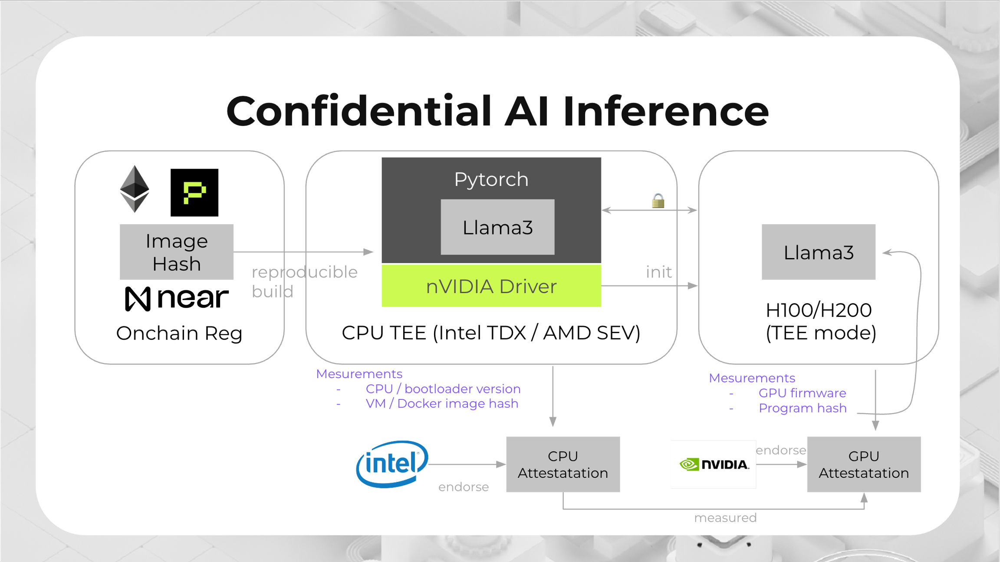

# Private ML SDK

A secure and verifiable solution for running Large Language Models (LLMs) in Trusted Execution Environments (TEEs), leveraging NVIDIA GPU TEE and Intel TDX technologies.



## Overview

Private ML SDK provides a secure environment for running LLM workloads with guaranteed privacy and security, preventing unauthorized access to both the model and user data during inference operations. The solution leverages NVIDIA's TEE GPU technology (H100/H200/B100) and Intel CPUs with TDX support to ensure that AI model execution and data processing remain fully protected within secure enclaves.

Key features:
- Tamper-proof data processing
- Secure execution environment
- Open source and reproducible builds
- Verifiable execution results
- Nearly native speed performance (up to 99% efficiency)

## Architecture

The system consists of several core components:

- **Secure Compute Environment**: TEE-based execution environment
- **Remote Attestation**: Verification of the TEE environment
- **Secure Communication**: End-to-end encryption between users and LLM
- **Key Management Service (KMS)**: Key management service to manage keys for encryption and decryption

## Getting Started

### Build the TDX guest image

Prerequisites:
- Install Docker:
  ```bash
  curl -fsSL https://get.docker.com -o get-docker.sh
  sudo sh get-docker.sh
  ```
- Add the current user to the docker group:
  ```bash
  sudo usermod -aG docker $USER
  newgrp docker  # Apply group changes without logout
  ```
- Verify Docker installation:
  ```bash
  docker --version
  docker run hello-world
  ```

Clone the repository and build the TDX guest image:

```
git clone https://github.com/nearai/private-ml-sdk --recursive
cd private-ml-sdk/
./build.sh
```

If everything goes well, you should see the images files in `private-ml-sdk/images/`.

There are two image directories:
- `dstack-nvidia-*/`: the production image without developer tools.
- `dstack-nvidia-dev-*/`: the development image with developer tools, such as `sshd`, `strace`.

### Run the Local KMS

Before launching the CVM, ensure that the Local KMS is operational, as it provides the essential keys required for the proper initialization of the CVM. These keys are derived from the local TEE hardware environment.

The Local KMS service can be launched by following commands:

```bash
cd private-ml-sdk/meta-dstack-nvidia/dstack/key-provider-build/
./run.sh
```

### Run the TDX guest image

#### Using the dstack.py script (Deprecated)

This requires a TDX host machine with the TDX driver installed and Nvidia GPU what support GPU TEE installed.

```
# Add the scripts/bin directory to the PATH environment variable
pushd private-ml-sdk/meta-dstack-nvidia/scripts/bin
PATH=$PATH:`pwd`
popd

# List the Available GPUs
dstack lsgpu

# Output like the following:
# Available GPU IDs:
# ID      Description
# 18:00.0 3D controller: NVIDIA Corporation GH100 [H200 SXM 141GB] (rev a1)
# 2a:00.0 3D controller: NVIDIA Corporation GH100 [H200 SXM 141GB] (rev a1)
# 3a:00.0 3D controller: NVIDIA Corporation GH100 [H200 SXM 141GB] (rev a1)
# 5d:00.0 3D controller: NVIDIA Corporation GH100 [H200 SXM 141GB] (rev a1)
# 9a:00.0 3D controller: NVIDIA Corporation GH100 [H200 SXM 141GB] (rev a1)
# ab:00.0 3D controller: NVIDIA Corporation GH100 [H200 SXM 141GB] (rev a1)
# ba:00.0 3D controller: NVIDIA Corporation GH100 [H200 SXM 141GB] (rev a1)
# db:00.0 3D controller: NVIDIA Corporation GH100 [H200 SXM 141GB] (rev a1)

# Choose one or more GPU IDs and run the following command to create a CVM instance
dstack new app.yaml -o my-gpu-cvm \
    --local-key-provider \
    --gpu 18:00.0 \
    --image images/dstack-nvidia-dev-0.5.3 \
    -c 2 -m 4G -d 100G \
    --port tcp:127.0.0.1:10022:22 \
    --port tcp:0.0.0.0:8888:8888

# Run the CVM:
sudo -E dstack run my-gpu-cvm
```

An example of the `app.yaml` file is as follows:

```yaml
# app.yaml
services:
  jupyter:
    image: kvin/cuda-notebook
    privileged: true
    ports:
      - "8888:8888"
    volumes:
      - /var/run/tappd.sock:/var/run/tappd.sock
    deploy:
      resources:
        reservations:
          devices:
            - driver: nvidia
              count: all
              capabilities: [gpu]
    runtime: nvidia
```

#### Using dstack-vmm (Recommended)

This is the recommended approach for running TDX guest images in production environments. dstack-vmm is a developer-friendly and security-first SDK that simplifies the deployment of containerized apps into TEE.

**Quick integration with dstack-vmm:**

1. **Have dstack-vmm running**
   Follow the official guide to install and run dstack-vmm/gateway/KMS as needed. Docs: [dstack README](https://github.com/Dstack-TEE/dstack).

2. **Start Local KMS (from this repo)**
   In this repository, run the local key provider (uses AESMD on host):
   ```bash
   cd meta-dstack-nvidia/dstack/key-provider-build
   ./run.sh
   # Endpoint: https://localhost:3443
   ```

3. **Copy Private ML SDK images to the VMM images directory**
   On the host where dstack-vmm runs, copy our built images:
   ```bash
   # Production image (no SSH/tools)
   cp -r /path/to/private-ml-sdk/images/dstack-nvidia-*/ /path/to/dstack-vmm/images/

   # Development image (with SSH/strace etc.)
   cp -r /path/to/private-ml-sdk/images/dstack-nvidia-dev-*/ /path/to/dstack-vmm/images/
   ```

4. **Prepare your app compose (UI or CLI)**
   - Web UI: upload your `docker-compose.yml` directly in the VMM dashboard.
   - CLI (recommended for secrets):
     ```bash
     ./vmm-cli.py compose \
       --name my-app \
       --docker-compose ./docker-compose.yml \
       --kms \
       --env-file ./secrets.env \
       --output ./app-compose.json
     ```

5. **Deploy a CVM (select image, GPUs, ports, KMS)**
   - Find the image name: `./vmm-cli.py lsimage`
   - Find available GPUs: `./vmm-cli.py lsgpu`
   - Deploy:
     ```bash
     ./vmm-cli.py deploy \
       --name my-gpu-cvm \
       --image <exact-image-name-from-lsimage> \
       --compose ./app-compose.json \
       --vcpu 2 --memory 4G --disk 100G \
       --gpu <gpu-slot-or-use--ppcie> \
       --port tcp:127.0.0.1:8888:8888 \
       --kms-url https://localhost:3443
     ```
     Tip: Dev image only – add `--port tcp:127.0.0.1:10022:22` to enable SSH.

6. **Access and troubleshoot**
   - If `dstack-gateway` is enabled, prefer the public domain rules.
   - Without gateway, use your mapped host ports (e.g., `http://127.0.0.1:8888`).
   - Logs: `./vmm-cli.py logs <vm-id> -f`.

**Important Notes:**
- The default configuration is for local development and the KMS is not secure for production use
- For production deployments, follow the [security guide](https://github.com/Dstack-TEE/dstack/blob/master/docs/security-guide/security-guide.md)
- If using development images, you can SSH into the CVM for debugging: `ssh root@<cvm-wg-ip>`

  ##### Notes
  - **Environment variables (do NOT copy plain files in VMM mode)**
    - With dstack-vmm, pass secrets via CLI so they are encrypted client-side and decrypted inside CVM.
    - `--env-file` requires KMS to be enabled. In practice:
      - During compose creation, include `--kms` together with `--env-file` so the compose is marked KMS-enabled and the public key can be used for encryption.
      - During deploy, `--env-file` also assumes the app was composed with `--kms`.
      - Updating env at runtime via `update-env` also requires the VM/app to be KMS-enabled.
    - Recommended flow:
      ```bash
      ./vmm-cli.py compose --name my-app \
        --docker-compose ./docker-compose.yml \
        --kms \
        --env-file ./secrets.env \
        --output ./app-compose.json
      ```
      ```bash
      ./vmm-cli.py deploy ... --env-file ./secrets.env
      ```
      ```bash
      ./vmm-cli.py update-env <vm-id> --env-file ./new-secrets.env
      ```
      Avoid the earlier approach of copying `/tapp/env-file` — that path is for older flows and is not used by dstack-vmm.

  - **KMS vs Local Key Provider (LKP)**
    - KMS (recommended for production):
      - Supports `--env-file` (client-side encryption of env vars) and remote key provisioning.
      - Facilitates cross-machine migration of CVMs/state, because keys are derived and managed by an external, stable KMS root rather than tied to a single CPU.
      - Resilient to CPU microcode updates: keys remain decryptable after microcode updates.
    - Local Key Provider (`--local-key-provider`, suitable for local/dev or single-host scenarios):
      - Provides state persistence, but keys are derived from the SGX sealing key on the provider host.
      - Not resilient to CPU microcode updates: after a microcode update (or moving to a different CPU/machine), previously sealed data may become undecryptable.
      - Does not support the `--env-file` secure env workflow.

  - **KMS integration (persistence and keys)**
    - Local KMS from this repo (`meta-dstack-nvidia/dstack/key-provider-build/run.sh`) listens at `https://localhost:3443` and shares the AESMD socket.
    - When deploying via VMM, explicitly specify the KMS URL to enable disk and env encryption:
      ```bash
      ./vmm-cli.py deploy ... --kms-url https://localhost:3443
      ```
    - For production, use a hardened KMS and follow the security guide. You may manage trusted KMS public keys via:
      ```bash
      ./vmm-cli.py kms list
      ./vmm-cli.py kms add 0x<kms-pubkey>
      ./vmm-cli.py kms remove 0x<kms-pubkey>
      ```

  - **GPU usage inside containers**
    - In the CVM, your Docker Compose should request GPU with the NVIDIA runtime or device requests, for example:
      ```yaml
      version: '3.8'
      services:
        jupyter:
          image: <your-image>
          deploy:
            resources:
              reservations:
                devices:
                  - driver: nvidia
                    count: all
                    capabilities: [gpu]
          runtime: nvidia
      ```
    - At deploy time, choose GPU attachment in VMM:
      - Use `--ppcie` to attach ALL GPUs/NVSwitches (best for full-GPU workloads), or
      - Use `--gpu <slot>` for specific GPUs.

  - **Accessing your app (gateway vs local ports)**
    - If `dstack-gateway` is enabled, prefer the gateway domain rules documented in dstack to access services.
    - If gateway is not used, map host ports at deploy time, e.g. to expose Jupyter:
      ```bash
      ./vmm-cli.py deploy ... --port tcp:127.0.0.1:8888:8888
      ```
    - Dev images include SSH; to enable SSH, map port 22 from the CVM (e.g., `--port tcp:127.0.0.1:10022:22`). Production images do not ship SSH.

### Verifying the TDX CVM Service Status

1. **SSH into the CVM**
   Note: SSH access is only available when using the development image
   `images/dstack-nvidia-dev-*`.

   Execute the following command to establish an SSH connection:
   ```bash
   ssh -p 10022 root@localhost
   ```
   *Note: Port 10022 is mapped to the CVM's port 22 during the creation of the CVM.*

   After logging in, check the status of the Docker Compose services by running:
   ```bash
   docker ps -a
   ```

2. **Verify the Jupyter Service Status**
   To confirm that the Docker Compose services are running correctly, access the Jupyter service through your web browser:

   - For local access, navigate to:
     [http://localhost:8888](http://localhost:8888)
     *(Port 8888 is mapped to the CVM's port 8888 during the creation of the CVM.)*

   - For remote access, use the following URL:
     [http://<public-ip>:8888](http://<public-ip>:8888)
     *(Replace `<public-ip>` with the actual public IP address of your CVM.)*


### Updating the Environment Variables of the TDX CVM

Note: This section applies to the deprecated local/dstack.py workflow or manual host-shared setups. For dstack-vmm, do not copy files into `/tapp/env-file`; instead use the VMM CLI with `--env-file` during compose/deploy or `update-env` to update running VMs (see notes above).

To update the environment variables for the TDX CVM, execute the following command:
```bash
cp env-file <your-cvm-path>/shared/env-file
```

The `env-file` is a text file that contains the necessary environment variables for the Docker Compose services. An example of the contents of the `env-file` is as follows:
```
# env-file
REDPILL_API_KEY=sk-1234567890
REDPILL_MODEL=phala/llama-3.3-70b-instruct
```

After copying the `env-file`, restart the CVM. The environment variables specified in the `env-file` will be accessible within the Docker Compose service YAML. During the boot process, this `env-file` is copied to the `/tapp/env-file` directory within the CVM.

For instance, in your `docker-compose.yaml`, you can reference the `env-file` as shown below:

```yaml
# docker-compose.yaml, using the Jupyter service as an example
services:
  jupyter:
    env_file:
      - /tapp/env-file
```

This approach ensures that your environment variables are properly configured and accessible to your services.

### Getting TDX quote inside the container

1. Install the SDK package:
```bash
pip install dstack-sdk
```

2. Get TDX quote using Python:
```python
from dstack_sdk import DstackClient

# Initialize the client (defaults to /var/run/dstack.sock)
client = DstackClient()

# Get quote for a message
result = client.get_quote('test')
print(result.quote)
```

## Performance

Based on benchmarks running LLMs in NVIDIA H100 and H200:
- Efficiency approaches 99% as input size grows
- Minimal overhead for larger models (e.g., Phi3-14B-128k and Llama3.1-70B)
- Performance scales well with increased input sizes and model complexities
- I/O overhead becomes negligible in high-computation scenarios

## License

This project is licensed under the MIT License - see the [LICENSE](LICENSE) file for details.

## Contributing

Contributions are welcome! Please feel free to submit a Pull Request.

## References

- [NVIDIA Confidential Computing](https://www.nvidia.com/en-us/data-center/solutions/confidential-computing/)
- [Intel TDX Documentation](https://www.intel.com/content/www/us/en/developer/articles/technical/intel-trust-domain-extensions.html)
